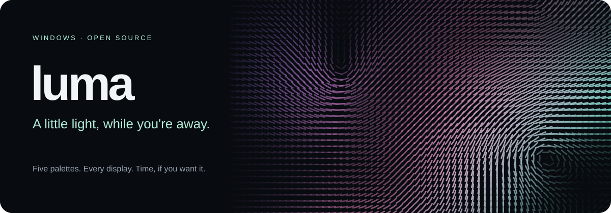

# Luma

Screensaver per Windows basato su [Flux di Sander Melnikov](https://github.com/sandydoo/flux), ispirato a Drift di macOS.

## Stato del prototipo

- Applicazione desktop con titolo ed eseguibile Luma.
- Modalità screensaver `/s`: schermo intero sul monitor principale, cursore nascosto.
- Uscita con un tasto, clic, rotella o movimento del mouse (soglia di 8 pixel logici, con due secondi di tolleranza per mouse e tastiera dopo il primo frame).
- `/c` mostra un messaggio informativo; `/p` termina senza aprire finestre. Impostazioni e anteprima integrata non sono ancora implementate.
- Prossimi passi: multimonitor, anteprima Windows, preferenze persistenti, icona e installer.

## Compilare su Windows

Prerequisiti: Rust stable tramite rustup, Visual Studio Build Tools con strumenti C++ x64 e Windows SDK.

Dalla radice del repository, in PowerShell:

```powershell
.\scripts\build-windows.ps1
```

Produce `target\release\Luma.exe` e `target\release\Luma.scr`, insieme alla licenza. La prima build richiede accesso a crates.io.

## Provare Luma

```powershell
# Prototipo in finestra
.\target\release\Luma.exe

# Screensaver a schermo intero
.\scripts\run-screensaver.ps1

# Prototipo in finestra anche dal file .scr
.\scripts\run-screensaver.ps1 -Windowed
```

Un `.scr` senza argomenti mostra il messaggio delle impostazioni. Questa versione non include ancora un installer.

## Test

```powershell
cargo test --locked --release -p luma -p luma-desktop
```

I test che richiedono una GPU sono esclusi per default. Per eseguirli aggiungere `-- --ignored --test-threads=1`.

## Struttura e origine

I pacchetti del motore e del desktop si chiamano `luma` e `luma-desktop`. Le cartelle `flux/` e `flux-desktop/`, l'alias Rust `flux` e i nomi interni del motore sono mantenuti per facilitare il confronto con upstream. `flux-wasm/`, `flux-gl/` e `web/` contengono i target web e OpenGL ereditati, il cui rebranding completo resta da fare.

## Crediti e licenza

Luma è un fork indipendente di Flux, © 2021 Sander Melnikov, distribuito con [licenza MIT](LICENSE). Il rendering originale e i relativi crediti restano attribuiti al progetto Flux. Il banner Luma è un nuovo asset SVG del fork.

## Diagnostica

Luma scrive il log di avvio e il motivo delle uscite da input in `target\release\Luma.log`. Il file viene riscritto ad ogni avvio. La perdita di focus non chiude lo screensaver.
